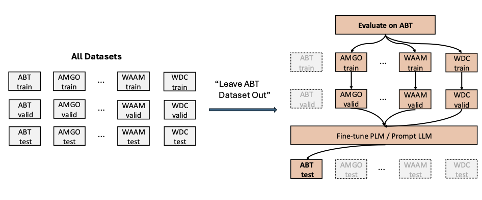
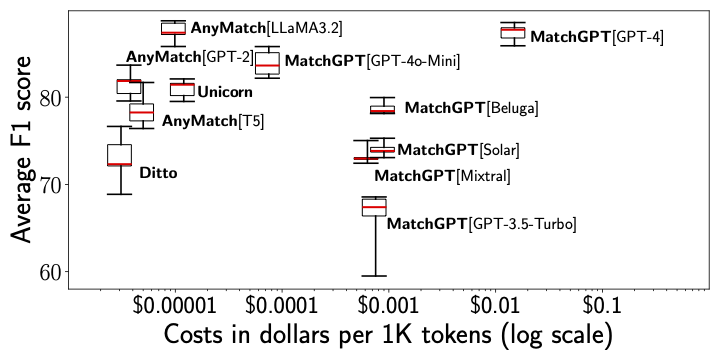

# Cross-Dataset-EM-Study

<div style="display: flex; justify-content: space-between; gap: 20px;">
  
  
</div>

This repository is the codebase of experiments and artificats of paper "[Experiments & Analysis] A Deep Dive Into Cross-Dataset Entity Matching with Large and Small Language Models". 

It includes the basic components and configurations for reproducing the evaluations described in the paper. For detailed implementations of each method, please refer to the original implementations linked here.

* ZeroER: https://github.com/chu-data-lab/zeroer
* Ditto: https://github.com/megagonlabs/ditto
* Unicorn: https://github.com/ruc-datalab/Unicorn
* AnyMatch: https://github.com/Jantory/anymatch
* Jellyfish: https://huggingface.co/NECOUDBFM/Jellyfish-13B
* MatchGPT: https://github.com/wbsg-uni-mannheim/MatchGPT
* FM-Data-Tasks (GPT3): "https://github.com/HazyResearch/fm_data_tasks"
* TableGPT: https://github.com/microsoft/Table-GPT


## Dataset
We use ten recognized benchmark datasets from the Magellan repository (the first eight are widely used in existing studies), 
along with the WDC dataset, which is a recent addition from the e-commerce data. 
For detailed source information about these datasets, please visit the links provided below:

|Abbr.| Dataset        |                                                                                              Link | 
|:---|:---------------|--------------------------------------------------------------------------------------------------:|
|wdc| wdc             |                                    [wdc](https://webdatacommons.org/largescaleproductcorpus/v2/ )  | 
|abt| abt_buy         |                  [magellan](https://github.com/anhaidgroup/deepmatcher/blob/master/Datasets.md  )  | 
|amgo| amazon_google  |                  [magellan](https://github.com/anhaidgroup/deepmatcher/blob/master/Datasets.md  ) | 
|beer| beer           |                  [magellan](https://github.com/anhaidgroup/deepmatcher/blob/master/Datasets.md  ) | 
|dbac| dblp_acm       |                  [magellan](https://github.com/anhaidgroup/deepmatcher/blob/master/Datasets.md  ) | 
|dbgo| dblp_scholar   |                  [magellan](https://github.com/anhaidgroup/deepmatcher/blob/master/Datasets.md  ) | 
|foza| fodors_zagat   |                  [magellan](https://github.com/anhaidgroup/deepmatcher/blob/master/Datasets.md  ) | 
|itam| itunes_amazon  |                  [magellan](https://github.com/anhaidgroup/deepmatcher/blob/master/Datasets.md  ) | 
|waam| walmart_amazon |                  [magellan](https://github.com/anhaidgroup/deepmatcher/blob/master/Datasets.md  ) | 
|roim| rottentomato_imdb| [magellan data](https://sites.google.com/site/anhaidgroup/useful-stuff/the-magellan-data-repository)|
|zoye| zomato_yelp| [magellan data](https://sites.google.com/site/anhaidgroup/useful-stuff/the-magellan-data-repository)|\


The training and validation sets for each dataset originate from their respective sources. However, the test set is down-sampled to a maximum of 1,250 samples to optimize the cost of OpenAI API calls. For all baseline comparisons, the test set remains identical, adhering to the same leave-one-dataset-out configuration.

To conserve space, only the raw datasets are included in this repository. The code for processing and formatting them is available in `data/data_preparation.ipynb`. The datasets are first processed into a base format, which is subsequently adapted to create method-specific datasets. 

Moreover, to address the data leakage issue that might happend during fine-tuning phase, we conduct a SQL analysis to validate there is zero overlapping datapoints between any pair of datasets, which can be found in `data/data_leakage.py`.


## Different cross-dataset EM matchers
We compared the efficency of the following cross-dataset matchers, from both the predictive quality and cost dimensions.

### ZeroER
The code can be found in the `zeroer` folder. We use the vanilla implementation with the application of the transitivity constraint. To run the experiments, navigate to the folder and run --
```
python zeroer.py DATASET_NAME --run_transitivity
``` 

### Ditto
The code is located in the `ditto` folder. To comply with our 'leave-one-dataset-out' strategy, the training, validation, and test data must be configured accordingly, resulting in a new config.json file in the folder. Additionally, the dataset needs to be serialized into a format that Ditto recognizes. We provide the necessary code for this in the 'ditto/data' folder. To run the experiments, navigate to the folder and run --
```
python train_ditto.py \ --task DATASET_NAME \
  --batch_size 64 --max_len 64 --lr 3e-5 \
  --n_epochs 40 --lm bert --fp16 --da del --summarize
``` 

### Unicorn
The code is located in the `unicorn` folder. To ensure the evaluation aligns with the 'leave-one-dataset-out' strategy, we adjust the 'dataprocess/dataformat.py' file, using an ordinal number to represent each dataset that is left out. To run the experiments, navigate to the folder and run --
```
python main-zero-ins.py --pretrain --model deberta_base --loo DATASET_ORDINAL
```

### AnyMatch
The code is located in the `anymatch` folder. To run the experiments, navigate to the folder and run --
```
python loo.py --leaved_dataset_name DATASET_NAME --base_model BASE_MODEL
``` 

### Jellyfish
The code is located in the `jellyfish` folder. We use the prompt suggested by the authors and download the model directly from Hugging Face for inference. A script to run the experiments is also provided
```
python jellyfish.py
```

### MatchGPT
The code is located in the matchgpt folder. Instead of using a notebook for all experiments, we adopt the same prompt system described in the original MatchGPT paper and convert everything into a Python script for improved parallel execution. For GPT models, we provide code both with and without demonstrations.
To run inference with GPT models, please use the following command:
```
python gpt.py --mid MODEL_ID --dem DEMONSTRATION_METHOD
```

To run other open models, use the following command:
```
python open_models.py --mid MODEL_ID
```

### TableGPT & GPT-3
We are unable to evaluate these two models because TableGPT is not open-sourced, and GPT-3 has been deprecated. Therefore, we include their results from the original papers for reference.

## Unified evaluation entry point
To simplify running evaluations across different methods, you can use
`eval_entrypoint.py` from the repository root. It dispatches to the
corresponding evaluation code for each matcher or a custom script.
Example usage:
```bash
python eval_entrypoint.py --method zeroer --dataset abt --seed 42
python eval_entrypoint.py --method anymatch --dataset dbgo --base_model llama3
```

For lightweight experimentation or CI checks, a toy `random_clustering` method
is provided. It predicts matches by randomly assigning records to clusters. The
script prints both the actual F1 score and the theoretical expectation based on
the number of clusters. You can run it on a single dataset or all datasets:
```bash
python eval_entrypoint.py --method random_clustering --dataset abt
python eval_entrypoint.py --method random_clustering --all
```

To benchmark a new method on all datasets at once, pass the path to the
script and use `--method custom --all`:
```bash
python eval_entrypoint.py --method custom --script my_method.py --all
```

## Inference throughput experiments
We provide the code to run the throughput experiments. To run the experiments, please use the following code:
```
python throughput.py --model_name MODEL_NAME
```

## Experimental results and analysis
The raw results for the reported numbers in Table 3 and Table 4 can be found in `results`. Moreover, a separate notebook containing all the analyses presented in the paper is available in `results/analysis.ipynb`.


